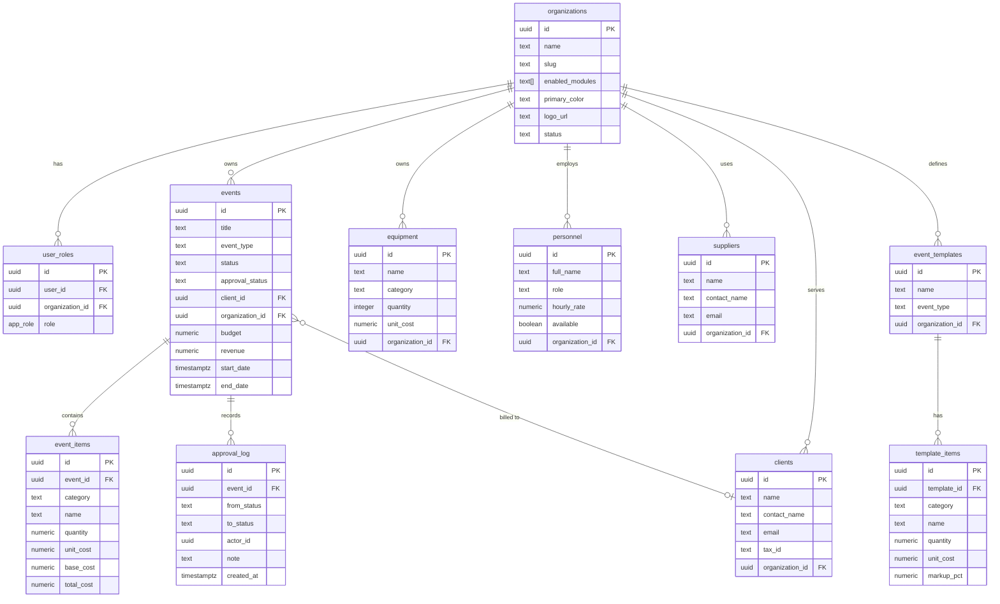
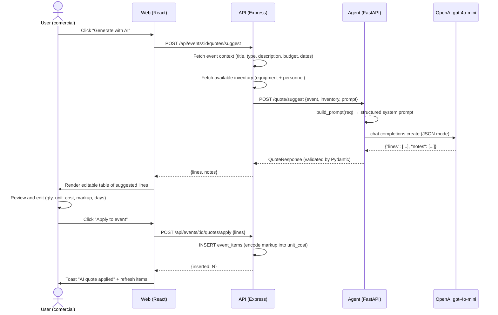
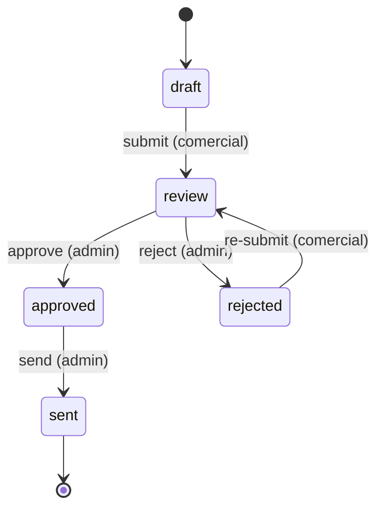
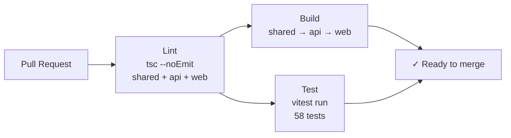

# Celeris — Technical Architecture Document

## 1. Overview

Celeris is a white-label, multi-tenant SaaS platform for ATL/BTL event operations companies. It replaces fragmented spreadsheets, WhatsApp quotes, and paper crew lists with a single workspace covering: AI-assisted quote generation, personnel and inventory management, supplier tracking, cost/margin analytics, and approval-flow invoicing — all under the client's own brand.

---

## 2. System Architecture

### 2.1 Component Diagram

```mermaid
graph TD
    subgraph Client
        B["Browser\n(React SPA)"]
    end

    subgraph Vercel
        WEB["apps/web\nVite + React + Tailwind\nShadcn UI"]
    end

    subgraph Render
        API["apps/api\nNode + Express\nPrisma &#36;queryRaw"]
        AGENT["agent\nPython + FastAPI\nOpenAI"]
    end

    subgraph Supabase
        AUTH["Auth\n(JWT, signIn/signUp)"]
        DB["PostgreSQL\nRLS enabled"]
        STORAGE["Storage\n(logos, attachments)"]
    end

    subgraph OpenAI
        GPT["gpt-4o-mini\nJSON structured output"]
    end

    B -- "hosts" --> WEB
    WEB -- "Auth only (signIn, getSession)" --> AUTH
    WEB -- "All data REST calls + Bearer JWT" --> API
    WEB -- "Logo upload" --> STORAGE
    API -- "Verify JWT (jose)" --> AUTH
    API -- "prisma.&#36;queryRaw (all queries)" --> DB
    API -- "POST /quote/suggest" --> AGENT
    AGENT -- "chat.completions" --> GPT
```



### 2.2 Request Flow (per API call)

```
Browser → POST /api/events/:id  (Bearer: Supabase JWT)
         ↓
         auth middleware        — jose.jwtVerify → { userId, email }
         ↓
         tenant middleware      — X-Org-Slug → orgId, roles, isSuperAdmin
         ↓
         requireModule(key)     — SELECT enabled_modules FROM organizations
         ↓
         requirePermission(p)   — can(roles, p) from @celeris/shared
         ↓
         service / handler      — prisma.$queryRaw`... WHERE organization_id = ${orgId}`
         ↓
         Response
```

### 2.3 Deployment Topology

| Service | Platform | Runtime | Notes |
|---------|----------|---------|-------|
| `apps/web` | Vercel | Vite (static) | SPA — all routes rewrite to `/index.html` |
| `apps/api` | Render | Node 20 | PORT from env; free tier cold-starts ~30 s |
| `agent` | Render | Python 3.12 | FastAPI + uvicorn |
| Database | Supabase | PostgreSQL 15 | RLS enabled on all tables |
| Auth | Supabase Auth | Managed | JWTs signed with `SUPABASE_JWT_SECRET` |
| Storage | Supabase Storage | Managed | Public bucket for org logos |

---

## 3. Data Model

### 3.1 Entity-Relationship Diagram



### 3.2 Key Schema Decisions

| Decision | Rationale |
|----------|-----------|
| `total_cost GENERATED ALWAYS AS (quantity * unit_cost)` | Prevents desync between quantity/unit_cost and total; never inserted or updated |
| `base_cost` column alongside `unit_cost` | Allows encoding markup without a separate quotes table; margin = `(unit_cost - base_cost) * quantity` |
| `enabled_modules text[]` on organizations | Module gating without a join table; simple `@> ARRAY[key]` check |
| `approval_log` append-only | Full audit trail; actor and timestamp immutable after insert |
| Schema source of truth = `supabase/migrations` | Prisma only does `db pull`; no `prisma migrate` risk of destructive diffs |
| RLS on all tables | Defense-in-depth: even if the API misses an `organization_id` filter, Supabase RLS blocks the row |

---

## 4. Security Model

### 4.1 Authentication

- Supabase Auth issues JWTs signed with `SUPABASE_JWT_SECRET`
- The API verifies every token with `jose.jwtVerify` — no Supabase SDK in the API
- The frontend uses Supabase client **only** for auth (`signInWithPassword`, `getSession`, `signOut`) and Storage (logo upload). All data goes through `apps/api`

### 4.2 Authorization — RBAC

Roles are stored in `user_roles.role` (enum: `admin`, `comercial`, `contable`, `logistica`, `personal`, `viewer`). The permission matrix is defined in `packages/shared/src/permissions.ts` and shared between API middleware and frontend nav visibility.

```
admin     → wildcard (*)
comercial → events CRUD, quotes CRUD, clients manage, inventory view, analytics
contable  → events read, quotes view + margin, analytics, clients read, export
logistica → assigned events, inventory, crew own, export own
personal  → assigned events only
viewer    → read-only across events, inventory, suppliers, analytics, clients
```

`can(roles, permission)` is a pure function — testable without a database.

### 4.3 Multi-Tenant Isolation

Every service function receives an `AuthContext` containing `orgId`. Every `$queryRaw` call includes `WHERE organization_id = ${orgId}`. Supabase RLS adds a second layer using the JWT's `organization_id` claim.

Verified by automated tests in `src/__tests__/tenant-isolation.test.ts`: mocks capture all Prisma call parameters and assert that `orgId` appears in every query and that another org's ID never appears.

### 4.4 Module Gating

`requireModule(key)` middleware runs before `requirePermission`. It queries `organizations.enabled_modules` and returns `403` if the key is absent. `super_admin` bypasses both middleware checks without a DB call.

---

## 5. Cost Engine

```
unit_cost  = selling price (what the client pays per unit)
base_cost  = original cost (what the company pays the supplier)
markup_pct = (unit_cost / base_cost - 1) * 100

total_cost [GENERATED] = quantity × unit_cost
margin     = (unit_cost - base_cost) × quantity
margin_pct = margin / revenue × 100
profit_pct = margin / subtotal × 100
```

Margin data is gated by the `quotes.view_margin` permission. Users without it see only `Total cost` and `Revenue` KPIs; `Margin` and `Profitability` cards are hidden, as are the markup badges on items and the AI dialog's Markup % column.

---

## 6. AI Quote Generation

### 6.1 Sequence Diagram



### 6.2 Markup Encoding

The agent returns `{ unitCost, markup }`. The API encodes these into the single `unit_cost` column:

```
stored_unit_cost = unitCost × (1 + markup / 100)
base_cost        = unitCost
```

This preserves full margin information while using the existing schema without an extra column.

---

## 7. Approval Flow



Each transition is recorded in `approval_log` (append-only). The allowed transitions are enforced in the API route handler via `ALLOWED_TRANSITIONS` map — invalid transitions return `400`.

PDF export is available for `approved` and `sent` events only. Client-facing PDFs never show margin columns.

---

## 8. White-Label System

Each organization has `primary_color` and `logo_url`. These are fetched on login and stored in a React context (`TenantConfigContext`). CSS variables are applied dynamically:

```ts
document.documentElement.style.setProperty("--color-primary", primary);
```

The same branding flows into PDF and Excel exports: the API fetches `primary_color` from the `organizations` table and applies it to the PDF header bar and Excel header row fill.

---

## 9. Test Coverage

| Suite | Tests | What it verifies |
|-------|-------|-----------------|
| `permissions.test.ts` | 17 | `can()` per role, multi-role aggregation, wildcards, empty roles |
| `cost-engine.test.ts` | 11 | Margin formula, IVA 19%, markup encoding/recovery, edge cases |
| `middleware.test.ts` | 16 | `requireModule()` 6 cases, `requirePermission()` 10 cases, super_admin bypass |
| `tenant-isolation.test.ts` | 14 | Every service passes `orgId`; cross-org params never appear |
| **Total** | **58** | **58/58 passing** |

Run with: `pnpm test`

---

## 10. CI Pipeline



Defined in `.github/workflows/ci.yml`. Triggers on PRs to `main`/`develop` and pushes to `main`.

---

## 11. Repository Layout

```
celeris/
├── apps/
│   ├── api/          Node + Express + Prisma
│   │   ├── src/
│   │   │   ├── middleware/   auth, module gating, RBAC
│   │   │   ├── routes/       one file per resource
│   │   │   ├── services/     DB logic via $queryRaw
│   │   │   └── __tests__/    Vitest test suites
│   │   └── prisma/           schema.prisma (generated, do not edit)
│   └── web/          Vite + React + Tailwind + shadcn
│       └── src/
│           ├── components/   UI components
│           ├── lib/          api client, labels, hooks
│           └── pages/        one file per route
├── packages/
│   └── shared/       Permissions map + shared types
├── agent/            Python FastAPI + OpenAI
├── supabase/
│   └── migrations/   SQL schema — single source of truth
├── scripts/
│   └── seed.ts       Demo data seeder
├── docs/             This document + DEPLOY.md + SMOKE_TEST.md
├── docker-compose.yml
├── render.yaml
└── .github/workflows/ci.yml
```
